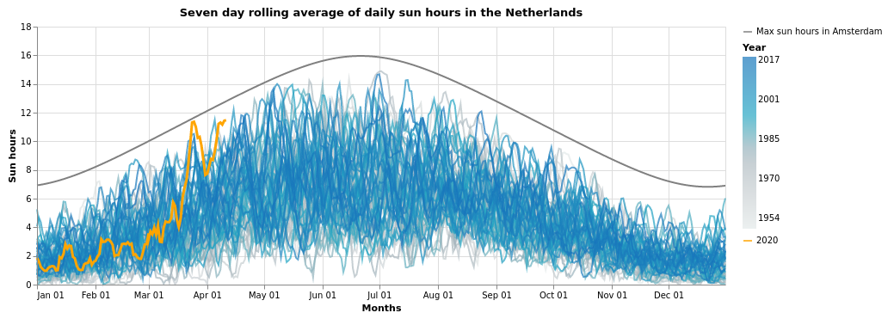

# Corona weather effects analyses
Analysis of the weather in the Netherlands during the 2020 corona crisis. 

Inspired by this [article](https://www.nature.com/articles/418601a) I was curious if there was any effect on the weather of the reduced air traffic.

I analyzed data from the Netherlands and didn't really find a large effect for the temperature differences as they did in the article. However, I did find that it was awfully sunny!

Source: [KNMI](https://www.knmi.nl/kennis-en-datacentrum/achtergrond/data-ophalen-vanuit-een-script).

For more details see the Jupyter notebooks for [🇳🇱 NL](CoronaWeather_NL.ipynb) and [🇨🇭 CH](CoronaWeather_CH.ipynb) or rerun the notebook in Colab ([🇳🇱 NL](https://colab.research.google.com/github/Roald87/CoronaWeather/blob/master/CoronaWeather_NL.ipynb#) and [🇨🇭 CH](https://colab.research.google.com/github/Roald87/CoronaWeather/blob/master/CoronaWeather_CH.ipynb#)) to see the latest data. Note: Somehow you need to rerun cells which plot the data a second time before the plots show in Colab.
